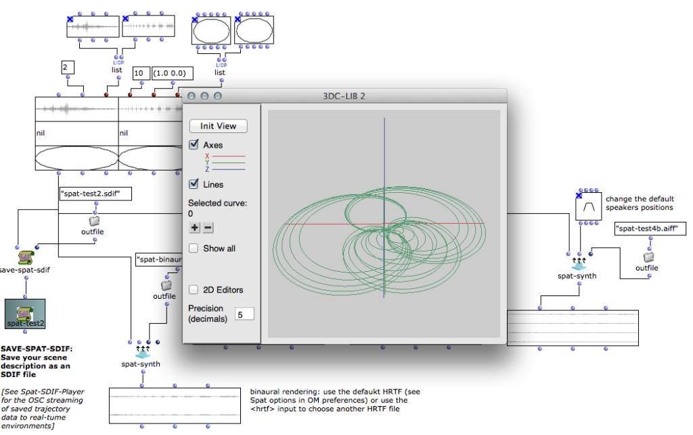

# OM-Spat

Sound spatialization in OpenMusic using Spat.

OM-Spat is a library for the creation and rendering of spatial scenes in OpenMusic. The scenes are represented as matrix-like objects associating sound sources and spatial trajectories.

OM-Spat implements a storage of the source trajectories and spatial attributes using the [SDIF format](http://sdif.sourceforge.net/). Generated SDIF files can be rendered by the Spat-renderer kernel or streamed to real-time environments via the [Spat-SDIF-Player](https://github.com/j-bresson/Spat-SDIF-Player) (applications to be installed separately).

---------------------

This program is free software. It is distributed in the hope that it will be useful, but WITHOUT ANY WARRANTY, without even the implied warranty of MERCHANTABILITY or FITNESS FOR A PARTICULAR PURPOSE. 

_This library does NOT include Spat sources or binaries, which must be installed separately and (if necessary) located in the Spat section of OM Preferences/Libraries tab._

---------------------

Design and development: Jean Bresson, IRCAM Representations Musicales.

Contributions: Marlon Schumacher, (CIRMMT / McGill University).

OM-Spat is inspired from previous works by Carlos Agon and Gilbert Nouno.

Spat renderer by Thibaut Carpentier, IRCAM Acoustic and Cognitive Spaces.
